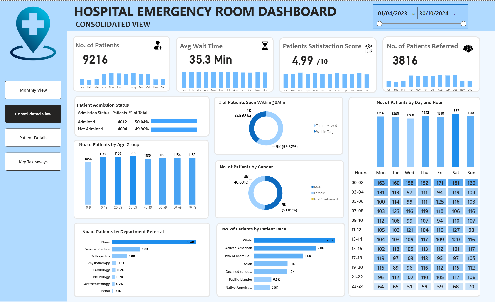

# 🏥 HOSPITAL-EMERGENCY-ROOM-DASHBOARD

## Power BI | Healthcare Operations Analytics

### 📌 Executive Summary

This project analyzes 19 months of Emergency Room (ER) data (April 2023 – October 2024) to evaluate operational efficiency, patient flow, wait times, satisfaction levels, referral patterns, and admission trends.

The goal of this dashboard is to provide hospital decision-makers with actionable insights to optimize staffing, reduce wait times, and improve patient experience.

#### Key Metrics:

- 9,216 unique patients

- 35.3 minutes average wait time

- 4.99 / 10 average satisfaction score

- 59.3% of patients seen within 30 minutes

- ~50% admission rate

---

### 🎯 Business Problem

Emergency departments operate in high-pressure environments where inefficiencies directly impact patient outcomes and satisfaction.

This project answers the following operational questions:

- When are peak congestion periods?

- Are patients being attended to within target wait times?

- What demographic groups form the largest patient segments?

- What percentage of patients are admitted vs discharged?

- Which departments receive the highest referrals?

The objective is to support data-driven staffing and operational decisions.

---

### 📊 Dashboard Preview

#### Consolidated View

---

#### Monthly Drill-Down View

---

#### Key Takeaways

---

### 📊 Dataset Overview

The dataset contains **9,216 ER visit records** over a 19-month period.

#### Key Features

- Visit date and hour

- Patient age group

- Gender

- Race

- Wait time (minutes)

- Admission status (Admitted / Not Admitted)

- Department referral

- Satisfaction score (1–10 scale)

The data supports time-based, demographic, and operational KPI analysis.

---

### 🧠 Analytical Approach

The dashboard was built using Power BI, focusing on descriptive and operational analytics.

#### 1️⃣ Data Preparation

- Cleaned and standardized time fields

- Created age group categories

- Structured admission and referral classifications

- Validated demographic distributions

#### 2️⃣ KPI Development

- Core performance indicators include:

- Total Patients

- Average Wait Time

- Admission Rate

- Patient Satisfaction Score

- % Seen Within 30 Minutes

#### 3️⃣ Time-Based Analysis

- Monthly performance tracking

- Day-of-week trend analysis

- Hourly heatmap to detect congestion patterns

#### 4️⃣ Demographic & Referral Analysis

- Age group distribution

- Gender breakdown

- Racial composition

- Department referral frequency

- Operational insight extraction

- Executive-level dashboard storytelling

---

### 🔎 Key Insights
#### ⏱ Patient Flow & Wait Time

Average wait time: **35.3 minutes**

Only **59.3%** of patients seen within 30 minutes

Indicates opportunity to improve triage efficiency and staffing allocation

#### 📅 Peak Demand Periods

**Busiest Days:**

- Monday (1,377 patients)

- Saturday (1,322 patients)

- Tuesday (1,318 patients)

**Busiest Hours:**

- 11 AM

- 1 PM

- 7 PM

- 11 PM

Late mornings and evenings show consistent congestion.

#### 🏥 Admission Patterns

- **4,612 admitted (50.04%)**

- **4,604 treated and released (49.96%)**

The near-even distribution suggests balanced ER case severity and resource demand.

#### 🩺 Department Referrals

- 5,400 patients required no referral

- Most common referrals:

  - General Practice (1,840)

  - Orthopedics (995)

  - Physiotherapy (276)

  - Cardiology (248)

Musculoskeletal and general cases form a large portion of workload.

---

### 👥 Demographic Insights

Largest age group: **30–39 years (1,200 patients)**

Gender distribution: ~51% female, ~49% male

Largest racial group: White (2,571), followed by African American (1,951)

The ER serves a diverse patient population across age and race.

---

### ⭐ Patient Satisfaction

- Average satisfaction score: **4.99 / 10**

- Suggests moderate patient experience levels

- Likely influenced by wait times during peak hours

---

### 📅 Monthly Drill-Down Capability

The dashboard includes dynamic filtering by:

- Year

- Month

- Consolidated vs Monthly View

Example (November 2023):

- 464 patients

- 35.2 min average wait

- 5.09 satisfaction score

- 57.5% seen within 30 minutes

This enables seasonal and performance trend comparison.

---

### 📈 Business Recommendations

Based on the analysis:

- Increase staffing during identified peak hours

- Improve triage processes to raise % seen within 30 minutes

- Investigate drivers of moderate satisfaction scores

- Implement predictive staffing models using historical trends

- Consider fast-track pathways for non-admission cases

---

### 🛠 Tools & Technologies

- Power BI

- DAX (Data Analysis Expressions)

- Data Modeling

- KPI Framework Design

- Healthcare Operational Analytics

---

### 💡 Skills Demonstrated

- Descriptive healthcare analytics

- KPI development & dashboard design

- DAX measure creation

- Time-series analysis

- Operational insight extraction

- Data storytelling for decision-makers

---

### 🚀 Project Value

This dashboard demonstrates the ability to:

- Translate raw healthcare data into business insights

- Identify operational bottlenecks

- Design executive-ready reporting solutions

- Align analytics with strategic decision-making
